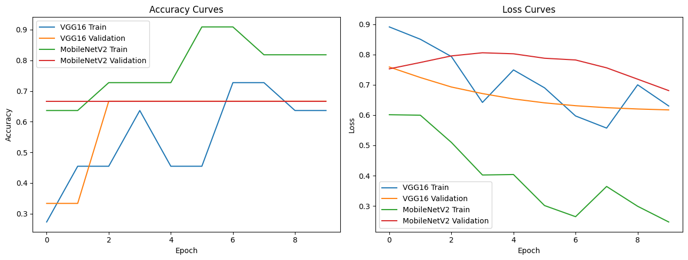
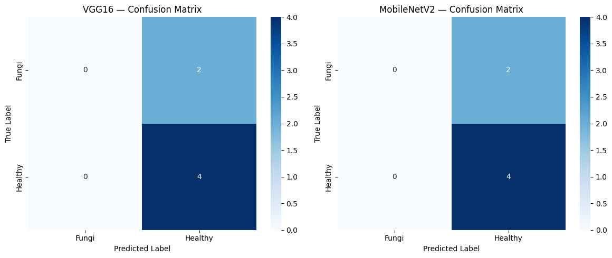

# Assignment 1 — VGG16 vs MobileNetV2

## Transfer Learning for Potato Leaf Classification

**Student:** Zehra Nisar  
**Task:** Computer Vision — Assignment 1

---

## 1. Overview

This assignment demonstrates transfer learning using two ImageNet-pretrained CNN architectures:

- **VGG16**
- **MobileNetV2**

The models classify potato leaf images into:

- **Fungi**
- **Healthy**

The experiment compares test accuracy, loss, confusion matrices, training/validation curves, parameter count, and inference time.

> **Dataset note:** The supplied dataset contains only 20 images (6 Fungi and 14 Healthy). The results are therefore a small experimental demonstration, not a production-quality disease-detection benchmark.

---

## 2. Objective

The objectives are to:

1. Apply transfer learning to image classification.
2. Use VGG16 and MobileNetV2 with ImageNet-pretrained weights.
3. Compare training and validation behavior.
4. Evaluate both models on a held-out test set.
5. Analyze confusion matrices and classification metrics.
6. Compare model size and inference time.

---

## 3. Dataset

| Class | Images |
|---|---:|
| Fungi | 6 |
| Healthy | 14 |
| **Total** | **20** |

### Dataset Split

| Class | Train | Validation | Test |
|---|---:|---:|---:|
| Fungi | 3 | 1 | 2 |
| Healthy | 8 | 2 | 4 |
| **Total** | **11** | **3** | **6** |

Because the dataset is very small, the validation and test metrics can change substantially with a different split.

---

## 4. Methodology

### Preprocessing

- Image size: **224 × 224**
- Pixel scaling: **1/255**
- Batch size: **4**
- Epochs: **10**
- Random seed: **42**

### Transfer Learning Pipeline

1. Load ImageNet-pretrained VGG16 and MobileNetV2.
2. Remove the original classification head.
3. Freeze the pretrained convolutional base.
4. Apply Global Average Pooling.
5. Add a Dense layer with 128 neurons.
6. Apply Dropout (0.30).
7. Use a sigmoid output for binary classification.
8. Train with Adam and binary cross-entropy.

---

## 5. Training & Validation Curves



### Graph Analysis

- VGG16 training accuracy increases from approximately **27%** to around **73%**.
- MobileNetV2 reaches approximately **91%** training accuracy during the later epochs.
- Validation accuracy stays around **66.67%** during the later epochs.
- The gap between training and validation performance should be interpreted carefully because the validation set contains only **3 images**.

The curves illustrate model behavior on this small dataset and should not be treated as a reliable generalization benchmark.

---

## 6. Confusion Matrices



### Confusion Matrix Analysis

For both VGG16 and MobileNetV2:

- **4 Healthy images** were correctly classified as Healthy.
- **2 Fungi images** were classified as Healthy.
- No Fungi image was correctly identified as Fungi in this test split.

Therefore:

**4 correct predictions / 6 test images = 66.67% accuracy**

The models had difficulty recognizing the Fungi class in this particular test set. Since only two Fungi images were in the test set, this result cannot be generalized to a larger dataset.

---

## 7. Classification Results

| Metric | VGG16 | MobileNetV2 |
|---|---:|---:|
| Test Accuracy | **66.67%** | **66.67%** |
| Test Loss | 0.6515 | 0.7337 |
| Test Images | 6 | 6 |

### Classification Report

| Class | Precision | Recall | F1-score |
|---|---:|---:|---:|
| Fungi | 0.00 | 0.00 | 0.00 |
| Healthy | 0.67 | 1.00 | 0.80 |
| Accuracy | **0.67** | — | — |

The zero Fungi precision/recall is consistent with the confusion matrices: both Fungi samples were predicted as Healthy.

---

## 8. Model Efficiency Comparison

| Model | Parameters | Inference Time |
|---|---:|---:|
| VGG16 | 14,780,481 | 2.7013 sec |
| MobileNetV2 | 2,422,081 | 0.1999 sec |

In this run, MobileNetV2 used substantially fewer parameters and had a shorter measured inference time. The exact timing depends on the hardware and runtime environment.

---

## 9. Conclusion

This assignment demonstrates transfer learning for binary potato leaf classification using VGG16 and MobileNetV2.

Both models achieved **66.67% test accuracy** on the six-image test set. The confusion matrices show that the Healthy samples were correctly classified, while the two Fungi samples were predicted as Healthy.

The experiment also shows a large efficiency difference between the architectures: MobileNetV2 has substantially fewer parameters and a shorter measured inference time in this run.

The most important limitation is the very small dataset. A larger, balanced dataset would be required for meaningful disease-classification evaluation.

---

## 10. Repository Files

```text
Assignment-1/
├── Assignment-1.ipynb
├── README.md
└── results/
    ├── training_curves.png
    └── confusion_matrices.png
```

### `Assignment-1.ipynb`

The notebook contains:

- Dataset verification
- Dataset splitting
- Image preprocessing
- VGG16 model
- MobileNetV2 model
- Model training
- Test evaluation
- Classification reports
- Confusion matrices
- Training/validation curves
- Parameter comparison
- Inference-time comparison
- Final analysis

---

## 11. How to Run

The notebook was developed and executed in **Google Colab**.

1. Open `Assignment-1.ipynb` in Google Colab.
2. Upload/extract the potato leaf dataset.
3. Ensure the `Healthy` and `Fungi` folders are available.
4. Run the notebook cells in order.
5. The notebook generates the evaluation figures in the `results` folder.

---

## Student

**Zehra Nisar**

**Computer Vision — Assignment 1**
